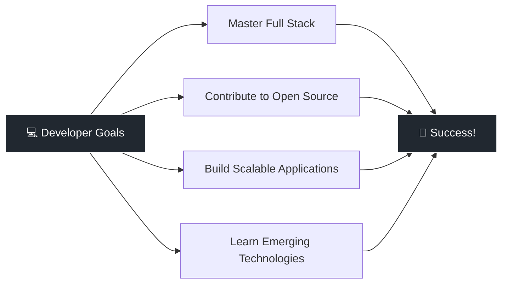

# 👋 Hello! I'm void

---

## 📋 About Me

<table>
<tr>
<td>

### 👨‍💻 **void**
**Pronouns:** He/Him

**🎯 Interests:**  
`Software Development` · `Cloud Computing` · `UI/UX` · `Music` · `Cats`

**🌱 Currently Learning:**  
`React` · `TypeScript` · `Cloud Technologies`

**⚡ Quick Facts:**  
• Problem solver with a passion for clean code  
• Always exploring new technologies  
• Coffee enthusiast ☕  
• Cat lover 🐱

</td>
</tr>
</table>

### 🚀 What I'm Up To

🔭 Building innovative web applications  
🌱 Expanding my technical skillset  
👯 Open to collaboration on interesting projects  
💬 Let's talk tech, code, and ideas  
⚡ Driven by curiosity and creativity

---

## 🛠️ Tech Stack & Tools

### Languages

### Frameworks & Libraries

### Tools & Platforms

---

## 📊 GitHub Stats

---

## 🏆 GitHub Trophies

---

## 🌟 Featured Projects

---

## 🎯 Current Goals

---

## 📫 Connect with Me

---

## 🎨 Random Dev Quote

---

## 📈 Profile Views

### Thanks for visiting! Let's build something amazing together! 🚀

