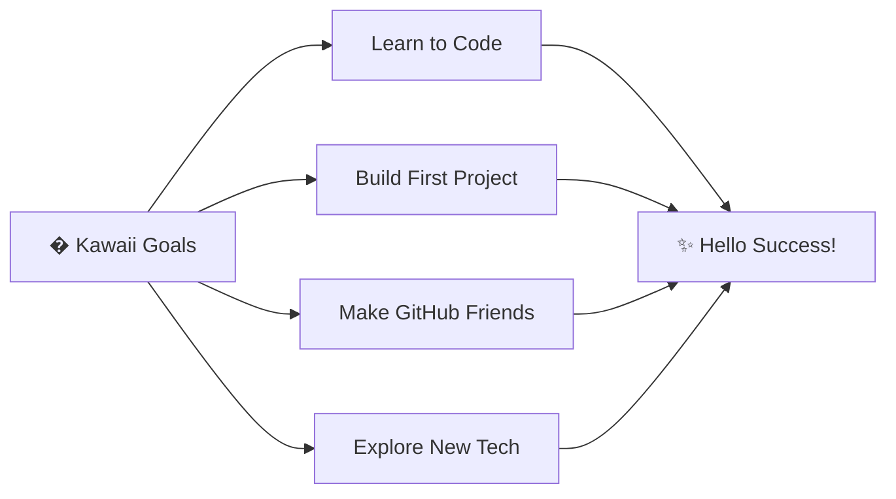

# � Hello! I'm AJ (gonzagaav) �

### *"Let's code with kawaii vibes!"* �✨

---

## 🎀 About Me

<table>
<tr>
<td>

### 👤 **AJ (gonzagaav)**
**Status:** 🌸 New GitHub Explorer  
**Location:** � Kawaii Code Corner  

**💖 Favorite Things:**  
`coding` · `pink aesthetics` · `learning` · `Hello Kitty` · `creativity`

**🌱 Currently:**  
`Starting my GitHub journey` · `Building new skills` · `Exploring possibilities`

**✨ Fun Fact:**  
*Every line of code is cuter with a Hello Kitty theme!* �

**🎨 Vibes:**  
💕 Kawaii Coding · � Creative Learning · � Making Magic · ✨ Growing Daily

</td>
</tr>
</table>

### 🌟 My Journey

🎀 Just started on GitHub  
💖 Learning and growing every day  
✨ Building something amazing soon  
💬 Open to learning and collaboration!  
⚡ Fueled by creativity and kawaii energy 🎀💖

---

## 🛠️ Skills & Interests

### 🌸 What I'm Exploring

### 🎀 Tools I Love

---

## 📊 GitHub Stats

---

## 🏆 GitHub Trophies

---

## 🌸 Welcome to My Journey!

> 💖 *"This is just the beginning of my coding adventure!"*  
> 🎀 *"Every day is a new opportunity to learn and create!"*  
> ✨ *"Stay kawaii, stay creative!"*

### 🌸 Quick Facts About Hello Kitty 🌸

| 🎀 Character | 📝 Details |
|-------------|-----------|
| **Full Name** | Kitty White |
| **Birthday** | November 1st |
| **Best Friend** | Dear Daniel |
| **Favorite Food** | Apple pie made by Mama 🍎 |
| **Hobby** | Baking cookies, making friends |
| **Dream** | To be a poet or pianist |

---

## 🎯 Current Goals

---

## 💌 Let's Connect!

---

## 🎨 Daily Inspiration

---

## 📈 Profile Views

### Thanks for stopping by! Have a wonderful day! �✨

---

### � "You can never have too many friends!" 💖
### 🎀 Made with love and Hello Kitty magic ✨

