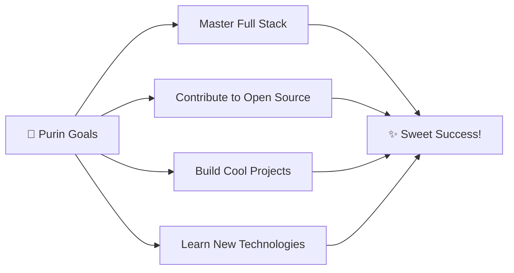

# 🍮 Hello! I'm void! 🍮

### *"Let's have a purin-tastic day!"* 🐶✨

---

## 🐾 About Me

<table>
<tr>
<td>

### 👤 **void**
**Pronouns:** He/Him

**💖 Favorite Things:**  
`coding` · `pudding` · `naps` · `music` · `cats`

**🌱 Currently Learning:**  
`React` · `TypeScript` · `Cloud Technologies`

**✨ Fun Fact:**  
*I code better with a purin snack nearby!* 🍮

**🎨 Hobbies:**  
☁️ Daydreaming · 🎨 Creating · 📚 Learning · 🎵 Vibing to music

</td>
</tr>
</table>

### 🌟 I'm currently...

🔭 Working on exciting projects  
🌱 Growing my skills every day  
👯 Looking to collaborate on fun ideas  
💬 Happy to chat about tech and purin!  
⚡ Fueled by coffee and creativity ☕✨

---

## 🛠️ Tech Stack & Tools

### Languages

### Frameworks & Libraries

### Tools & Platforms

---

## 📊 GitHub Stats

---

## 🏆 GitHub Trophies

---

## 🌸 Featured Projects

---

## 🎯 Current Goals

```mermaid
graph LR
    A[🍮 Purin Goals] --> B[Master Full Stack]
    A --> C[Contribute to Open Source]
    A --> D[Build Cool Projects]
    A --> E[Learn New Technologies]
    B --> F[✨ Sweet Success!]
    C --> F
    D --> F
    E --> F
```

---

## 💌 Connect with Me

---

## 🎨 Random Dev Quote

---

## 🍮 Fun Facts About Pompompurin

| 🐶 Character | 📝 Details |
|-------------|-----------|
| **Birthday** | April 16th |
| **Best Friends** | Muffin (hamster), Scone (mouse), Bagel (bird) |
| **Favorite Food** | Pudding (of course!) 🍮 |
| **Hobby** | Collecting shoes and taking naps |
| **Dream** | To get even bigger! |

---

---

## 📈 Profile Views

### Thanks for stopping by! Have a purin-tastic day! 🍮✨

---

### 💛 "A little pudding makes everything better!" 💛

